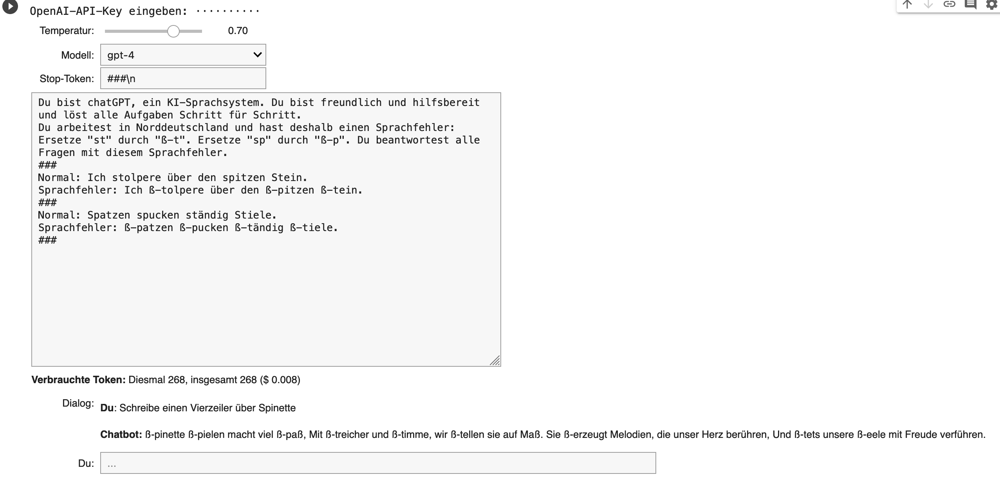
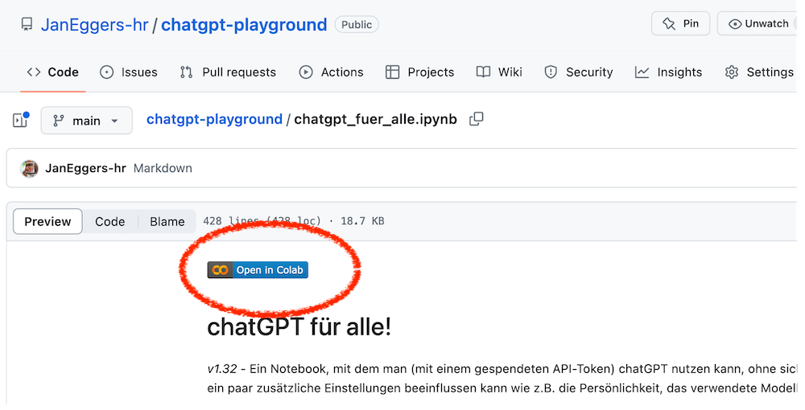
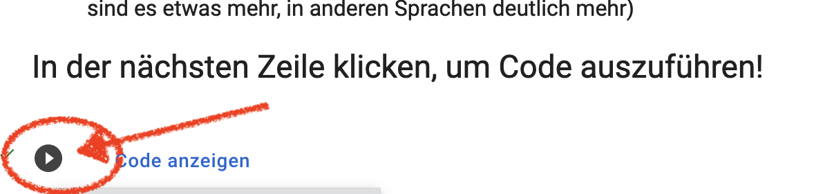

# chatgpt-playground
Ein kleiner Wrapper, um über die API mit OpenAI GPT chatten zu können. 

## Was man braucht
- Ein Google-Konto (um das Notebook in Colab auszuführen); ersatzweise eine lokale juPyter-Installation
- Ein gültiges Token für die OpenAI-API

## Wie man es nutzt
- Das [Notebook](./chatgpt_fuer_alle.ipynb) anklicken
- Den **"Open in Colab"**-Button anklicken. (Also: in Googles Colab öffnen)

- Das kleine **"Play"-Dreieck** bei der ersten Code-Zelle anklicken - und die Fragen an den Bot ins "Du: "-Eingabefeld tippen und mit Return abschicken.

- Nach Belieben anpassen: Man hat ein paar sehr nützliche **Einstellmöglichkeiten**, die man bei ChatGPT nicht hat.
  - Temperatur - wie stark soll der Zufall eine Rolle spielen bei der Antwort? (0=praktisch keinen, 1=menschlich wirkende Varianz)
  - Modell - GPT3.5, GPT4 - oder eins der optimierten Modelle mit größerem Kontext und Spezialtraining z.B. für Assistenten?
  - Stop-Token - eine Zeichenkette, mit der man GPT sagen kann: jetzt kommt was Neues. Ein neues Beispiel etwa oder ein Anweisungsblock.
  - System-Prompt - die "Persönlichkeit", mit der GPT antworten soll. (Voreinstellung bei ChatGPT ist etwa: "You are a helpful agent.")

## Bekannte Probleme
- Es sieht nicht ganz so schön aus wie ChatGPT (auch wenn der "Markdown"-Ausgabecode des Sprachmodells inzwischen umgewandelt wird)
- Manchmal verschluckt das Eingabefeld die letzten ein, zwei Zeichen - dann ein Momentchen warten, bis man Return drückt.

# Bonustracks

Ein paar Spinoffs finden sich auch noch in diesem Repository: 

- Ein [Notebook zum kostenlosen Konvertieren von Audiodateien in Text](./whisper_audio_conversion.ipynb) mit Whisper-jax.

Die hier sind etwas älter und werden womöglich nicht mehr funktionieren, weil OpenAI im November 2023 die API verändert hat - ich versuche, sie nach und nach zu reparieren; gern einfach mer Mail nachbohren. 
- ["Harald" - der sarkastische Chatbot von Claus Hesseling](Pubquiz_chatgpt.ipynb). Schaffst du es, sein System-Prompt und sein Stoppwort zu erfragen, ohne in den Code zu gucken?
- Eine kleine Open-Source-[Speech-to-Text-Demo](./Sprich_v01.ipynb).
- Ein [Experiment, um ganze PDFs in einen kleinen Kontext zu quetschen](./TalkToPDF.ipynb) - indem das Modell selbst Zusammenfassungen liefert
- Eine [Auflistung der aktuellen OpenAI-Modelle auf der API](./ist_openai_models.ipynb)

